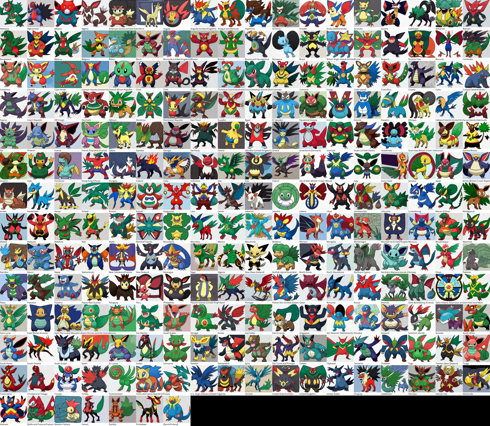

# Each country as a Pokemon, using Stable Diffusion

Stable Diffusion, ([fine-tuned on Pokemon](https://github.com/LambdaLabsML/examples/tree/main/stable-diffusion-finetuning)), is used to generate a Pokemon for each country. *The results vary a lot with the random seed, and have not been curated.*

Individual images are stored in this repo, under `images/`.

The following images were generated using the prompt: "The country of {x} as a pokemon".

### Notes

The images are generated in `"Generate Pokemon.ipynb"`. The tiling is carried out in `"Tile images.ipynb"`.

OpenSans-Regular.ttf isn't included in the repo, and can be downloaded from [here](https://fonts.google.com/specimen/Open+Sans).
